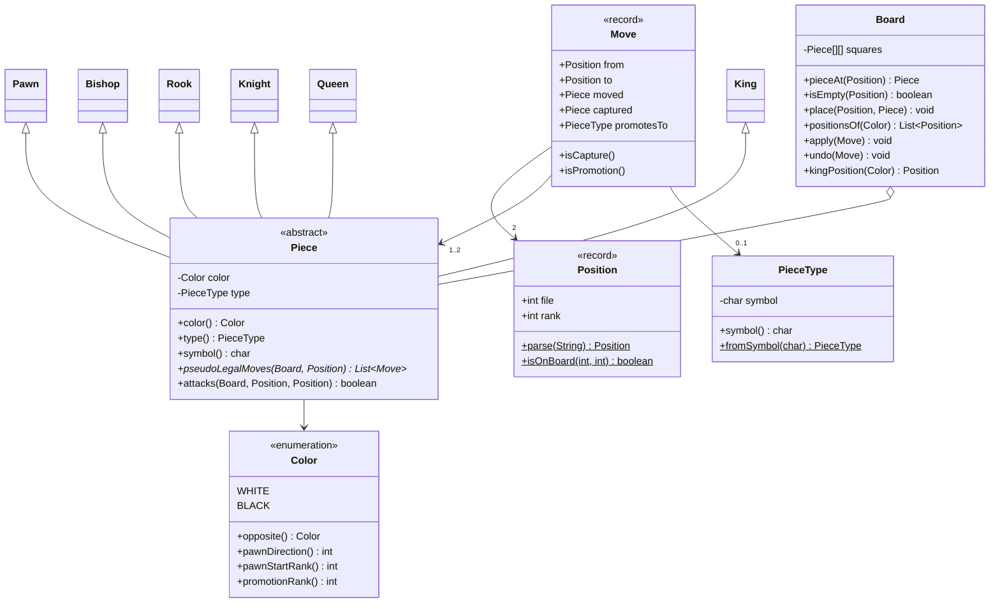
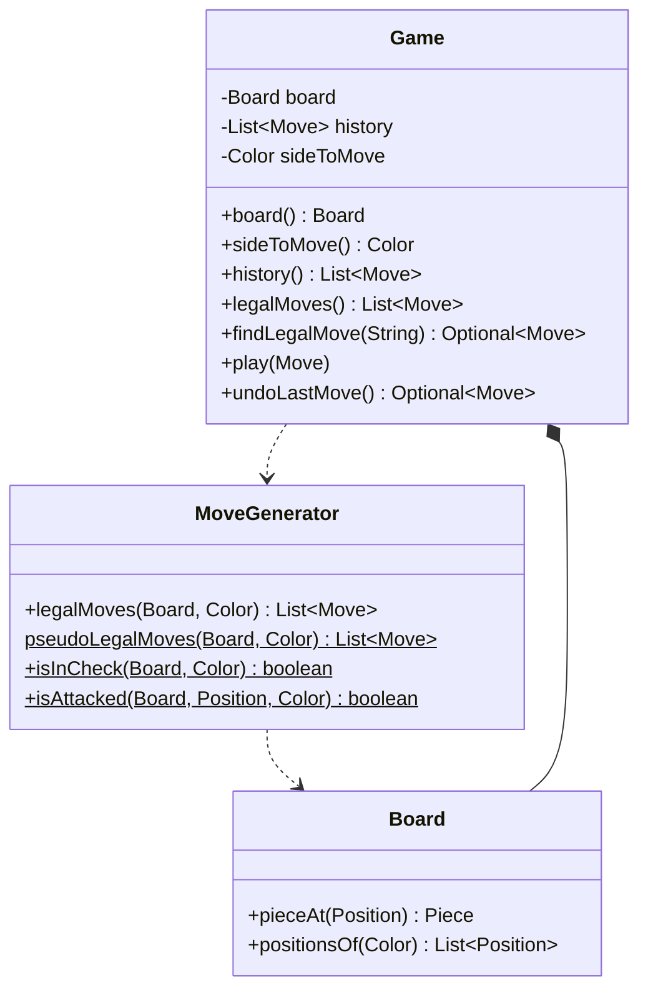
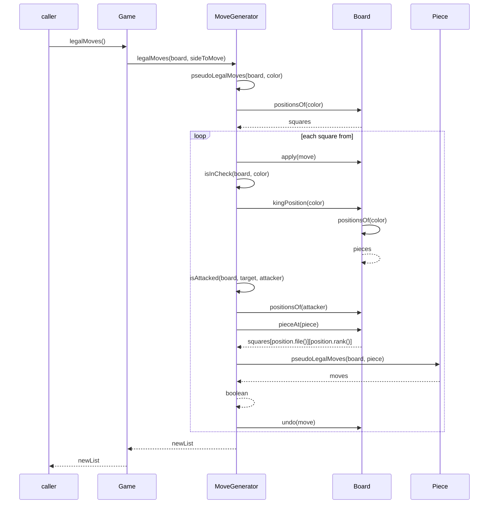

# Chess Engine Diagrams

## Class Diagram of Model

```mermaid
classDiagram
    class Position {
        +int file
        +int rank
        +parse(String) Position$
        +isOnBoard(int, int) boolean$
    }

    class Move {
        +Position from
        +Position to
        +Piece moved
        +Piece captured
        +PieceType promotesTo
        +isCapture()
        +isPromotion()
    }

    class Piece {
        -Color color
        -PieceType type
        +color() Color
        +type() PieceType
        +symbol() char
        +pseudoLegalMoves(Board, Position) List~Move~*
        +attacks(Board, Position, Position) boolean
    }

    class Board {
        -Piece[][] squares
        +pieceAt(Position) Piece
        +isEmpty(Position) boolean
        +place(Position, Piece) void
        +positionsOf(Color) List~Position~
        +apply(Move) void
        +undo(Move) void
        +kingPosition(Color) Position
    }

    class PieceType {
        -char symbol
        +symbol() char
        +fromSymbol(char) PieceType$
    }

    class Color {
        <<enumeration>>
        WHITE
        BLACK
        +opposite() Color
        +pawnDirection() int
        +pawnStartRank() int
        +promotionRank() int
    }

    <<record>> Position
    <<record>> Move
    <<abstract>> Piece

    Pawn <|-- Piece
    Bishop <|-- Piece
    Rook <|-- Piece
    Knight <|-- Piece
    Queen <|-- Piece
    King <|-- Piece
    Move --> "2" Position
    Move --> "1..2" Piece
    Move --> "0..1" PieceType
    Piece --> Color
    Board o-- Piece
```

## Class Diagram of Engine

```mermaid
classDiagram
    class Game{
        -Board board
        -List~Move~ history
        -Color sideToMove
        +board() Board
        +sideToMove() Color
        +history() List~Move~
        +legalMoves() List~Move~
        +findLegalMove(String) Optional~Move~
        +play(Move)
        +undoLastMove() Optional~Move~

    }

    class MoveGenerator{
        +legalMoves(Board, Color) List~Move~
        pseudoLegalMoves(Board, Color) List~Move~$
        +isInCheck(Board, Color) boolean$
        +isAttacked(Board, Position, Color) boolean$
    }

    class Board{
        +pieceAt(Position) Piece
        +positionsOf(Color) List~Position~
    }

    Game ..> MoveGenerator
    MoveGenerator ..> Board
    Game *-- Board
```

## Sequence Diagram of Game.legalMoves

```mermaid
sequenceDiagram
    caller->>Game: legalMoves()

    Game->>MoveGenerator: legalMoves(board, sideToMove)
    MoveGenerator->>MoveGenerator: pseudoLegalMoves(board, color)
    MoveGenerator->>Board: positionsOf(color)
    Board-->>MoveGenerator: squares
    loop each square from
        MoveGenerator->>Board: apply(move)
        MoveGenerator->>MoveGenerator: isInCheck(board, color)
        MoveGenerator->>Board: kingPosition(color)
        Board->>Board: positionsOf(color)
        Board-->>Board: pieces
        MoveGenerator->>MoveGenerator: isAttacked(board, target, attacker)
        MoveGenerator->>Board: positionsOf(attacker)
        MoveGenerator->>Board: pieceAt(piece)
        Board-->>MoveGenerator: squares[position.file()][position.rank()]
        MoveGenerator->>Piece: pseudoLegalMoves(board, piece)
        Piece-->>MoveGenerator: moves
        MoveGenerator-->>MoveGenerator: boolean
        MoveGenerator->>Board: undo(move)
    end
    MoveGenerator-->>Game: newList
    Game-->>caller: newList
```